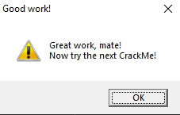

# Write-up crackme 

# Name: 
	Crackme.exe
# Format: 
	PE 32bits

# HASHS:

|               MD5                |                            SHA256                                |
| -------------------------------- | ---------------------------------------------------------------- |
| 66F573036F8B99863D75743EFF84F15D | 0C7CDFDB6D4C8876E9C5BAE906FCF1CBF174F019EF45D518954885856501A0BE |

# Sections :

|  Offset  |  Address  |      Name       |
|  ------- | --------- | --------------  |
| 00000000 |  00400000 |   PE Header     |
| 00000600 |  00401000 |   .CODE         |
| 00000c00 |  00402000 |   .DATA         |
| 00000e00 |  00403000 |   .idata        |
| 00001600 |  00404000 |   .edata        |
| 00001800 |  00405000 |   .reloc        |
| 00001a00 |  00406000 |   .rsrc         |
| 00002e00 |           |   Overlay       |

# Used tools for analysis: 
	Die, x32dbg.

__Libraries and functions used by the program (that are interesting)__

|   Library  |            Imported Functions            |
| ---------- | ---------------------------------------- |
| USER32.dll |       GetDlgItemTextA, MessageBoxA       |

__According to the documentation of Windows API, the functions mentioned above, have the following behavior__

__[GetDlgItemTextA](https://learn.microsoft.com/en-us/windows/win32/api/winuser/nf-winuser-getdlgitemtexta)__

  "Retrieves the title or text associated with a control in a dialog box."

__[MessageBoxA](https://learn.microsoft.com/pt-br/windows/win32/api/winuser/nf-winuser-messageboxa)__

  "Displays a modal dialog box that contains a system icon, a set of buttons, and a brief application-specific message, such as status or error information. The message box returns an integer value that indicates which button the user clicked."

__Normal behavior of the program__

__Inputing random values, we have the following result__

|    INPUT (Name & Serial)     |            RESULT              |
| ---------------------------- | ------------------------------ |
|  |  |

__Debugging x32dbg__

  To get an initial idea of where to start analyzing the binary, i chose to look at the intermodular calls of the program.

  It helps to understand which libraries and functions the binary uses and gives a "hint" about where to look among the large amount of assembly code.
  

  The functions marked with red are interesting to analysis because can give a hint of where to look at the binary.

  As soon previously, when the user input the 2 values (Name & SerialKey), the program return a windown with a phrase.
  Thus, it's possible that one of these called functions <JMP.&MessageBoxA> can show the window with the "successfull" phrase.

  Below, the ASM code before calling the function(MessageBoxA).

__[0x0040135C | call <JMP.&MessageBoxA>](ASM/0040135C_messageBoxA.s)__

__[0x00401378 | call <JMP.&MessageBoxA>](ASM/00401378_messageBoxA.s)__

__[0x004013BC | call <JMP.&MessageBoxA>](ASM/004013BC_messageBoxA.s)__

  As we can see, the binary uses the cdecl calling convention, since the arguments are pushed onto the stack from right to left.

  Analyzing the 3 blocks of ASM code before the call of the function, in the address [0x0040135C](ASM/0040135C.s), the following arguments are pushed in the stack before the call of the function.

  Thus, we can choose this address as a hint to continue our analysis.
  Verifying what addresses reference the function that "prepares" the arguments before calling the function, we have:
  
  

  With this information we can deduce that the CALL instruction (crackme.40134D) calls the function to prepare the stack for <MessageBoxA> function.

  "Good Work!" and "Great Work, mate!\r Now try the next Crackme!"

  Analyzing the instructions inside the scope of the called function, we have:

  [00401228 - 0040124C | instructions](ASM/crackme-401228.s) - ASM

  [validateInput.c](C/validateInput.c) - C (Pseudocode)

  Looking at the lines 00401228 and 00401233, we can see 2 arguments pushed onto the stack and followed by a function call. This function probably working with the pushed arguments (Name and SerialKey).

 __Analysis of the function [crackme.40137E](ASM/crackme-40137E.s):__

  In this function a loop executes with each char of the string, if < 'A', end the execution of the function.
  If char is >= 'Z', the program call a function that converts the letter to uppercase (subtracting 0x20).
  For example: if the char is a lowercase letter ('c'),the function will convert to uppercase letter.

  After verifying the string, the program makes a call to a function that returns the sum of the chars of the string XORed with 0x5678.
  
  Pseudocodes: [nameXor.c](C/nameXor.c), [charCmp](C/charCmp.c) and [charSum](C/charSum.c)

__Analysis of the function [crackme.4013D8](ASM/crackme-4013D8.s):__

  In this function, the program converts a string to its numerical value and returns the value XORed with 0x1234.
  
  For example: '1234' will return 1234(in base 10) and XOR with 0x1234.

  After these two functions execute, the program compares the values in the ($eax, $ebx) registers. If they are equal, a conditional jump is taken to crackme.40134D, which displays the success message.

  Showing the window with the "sucessfull" phrase.

  

  # [KeyGen](keygen.py)

  With a little bit of Python code, we can make a KeyGen that generates the SerialKey of the given Name. We can obtain the SerialKey of the corresponding Name with the following calculation:

  (Sum of string) XOR 0x5678 XOR 0x1234.

  End.
