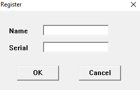
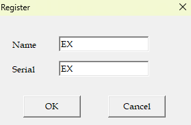
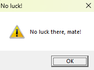
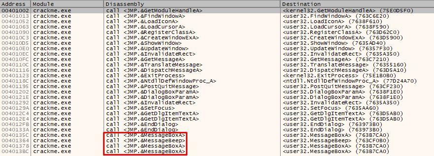
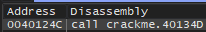

# Write-up crackme 

# Nome: 
	Crackme.exe
# Formato: 
	PE 32bits

# HASHS:

|               MD5                |                            SHA256                                |
| -------------------------------- | ---------------------------------------------------------------- |
| 66F573036F8B99863D75743EFF84F15D | 0C7CDFDB6D4C8876E9C5BAE906FCF1CBF174F019EF45D518954885856501A0BE |

# Seções:

|  Offset  |  Address  |      Name       |
|  ------- | --------- | --------------  |
| 00000000 |  00400000 |   PE Header     |
| 00000600 |  00401000 |   .CODE         |
| 00000c00 |  00402000 |   .DATA         |
| 00000e00 |  00403000 |   .idata        |
| 00001600 |  00404000 |   .edata        |
| 00001800 |  00405000 |   .reloc        |
| 00001a00 |  00406000 |   .rsrc         |
| 00002e00 |           |   Overlay       |

# Ferramentas utilizadas para análise: 
	Die, x32dbg.

__Bibliotecas e funções utilizadas pelo programa (que são interessantes)__

|   Library  |            Imported Functions            |
| ---------- | ---------------------------------------- |
| USER32.dll |       GetDlgItemTextA, MessageBoxA       |

__Conforme documentação da WINDOWSAPI, as funções mencionadas acima possuem o seguinte comportamento:__

__[GetDlgItemTextA](https://learn.microsoft.com/en-us/windows/win32/api/winuser/nf-winuser-getdlgitemtexta)__

  "Retrieves the title or text associated with a control in a dialog box."

__[MessageBoxA](https://learn.microsoft.com/pt-br/windows/win32/api/winuser/nf-winuser-messageboxa)__

  "Displays a modal dialog box that contains a system icon, a set of buttons, and a brief application-specific message, such as status or error information. The message box returns an integer value that indicates which button the user clicked."

__Comportamento Normal do Programa__

__Inserindo valores aleatórios, temos o seguinte resultado__

|    INPUT (Name & Serial)     |            RESULT              |
| ---------------------------- | ------------------------------ |
|  |  |

__Debugging x32dbg__

  Para ter "pistas" inicias de onde analisar e não ficar horas debuggando linhas de código em assembly que são inúteis (o que é bem comum), decidi olhar as chamadas intermodulares feitas pelo binário, dessa forma, é possível ter uma leve noção de quais funções e bibliotecas o binário utiliza, otimizando a busca por "pistas" no binário.
  

  As funções demarcadas em vermelho são úteis porque dão pistas para onde analisar no binário.
  Como visto anteriormente, quando inserido um valor (Name & SerialKey), o programa retornava uma janela com uma frase de erro.
  Portanto, é possível que alguma dessas chamadas de funções <JMP.&MessageBoxA> possa conter a janela com uma frase de "sucesso".

__[0x0040135C | call <JMP.&MessageBoxA>](ASM/0040135C_messageBoxA.s)__

__[0x00401378 | call <JMP.&MessageBoxA>](ASM/00401378_messageBoxA.s)__

__[0x004013BC | call <JMP.&MessageBoxA>](ASM/004013BC_messageBoxA.s)__

  Analisando as 3 chamadas de função, podemos verificar que na chamada [0x0040135C | call <JMP.&MessageBoxA>](ASM/0040135C_messageBoxA.s), temos 4 argumentos empilhados antes da chamada da função e 2 dos argumentos, possuem uma mensagem de "sucesso".

  "Good Work!" e "Great Work, mate!\r Now try the next Crackme!"

  Portanto, o ponto de investigação será na chamada 0x0040135C, para saber como é o processo de validação de entrada do executável.

  Verificando quais chamadas de função referenciam a primeira instrução da função, temos:

  

  Com base nessa informação, podemos deduzir que a instrução CALL crackme.40134D chama a função para exibir a janela com as mensagens:

  "Good Work!" e "Great Work, mate!\r Now try the next Crackme!"

  Analisando as instruções dentro do escopo da chamada função, temos:

  [00401228 - 0040124C | instructions](ASM/crackme-401228.s) 
  [validateInput.c](C/validateInput.c)

  Veja que nas linhas 00401228 e 00401233 temos 2 argumentos que são empilhados para a pilha (crackme.40218E, crackme.40217E) e logo em seguida, uma funçãom é chamada, provavelmente é uma funçãoq eu trabalha com o nome e a serial inseridos no programa.

 __Análise da função [crackme.40137E](ASM/crackme-40137E.s):__

  Nesta função, ocorre um loop que verifica cada caractere da string, se for < 'A', encerra a execução da função. 
  Se for >= 'Z', chama uma função que converte o caractere, subtraindo 0x20. 
  	Por exemplo: se for uma letra minúscula ('c'), vai converter para a letra maiúscula.
  Após percorrer a string, o programa faz uma chamada para uma função que retorna a soma dos caracteres da string e depois, a função principal retorna o resultado da operação XOR com a soma dos caracteres e o valor hexadecimal (0x5678).
  
  Pseudocódigos: [nameXor.c](C/nameXor.c), [charCmp](C/charCmp.c) e [charSum](C/charSum.c)

__Análise da função [crackme.4013D8](ASM/crackme.4013D8.s):__

  Nesta função, o programa converte uma string para o valor em formato inteiro e retorna este valor combinado com a operação XOR usando o valor hexadecimal (0x1234).

  Após a execução das 2 chamadas de função, o programa retorna para a função de validação da entrada e compara os valores presentes nos registradores $eax e $ebx, se forem iguais, um salto ocorre e o programa pula para a função crackme.40134D.
  Exibindo a janela com a mensagem de "sucesso".

  # [KeyGen](keygen.py)

  Com poucas linhas de código, é possível fazer um KeyGen que gera a serial correspondente ao nome inserido, permitindo obter "vitória" no crackme/desafio.

  Fim.
